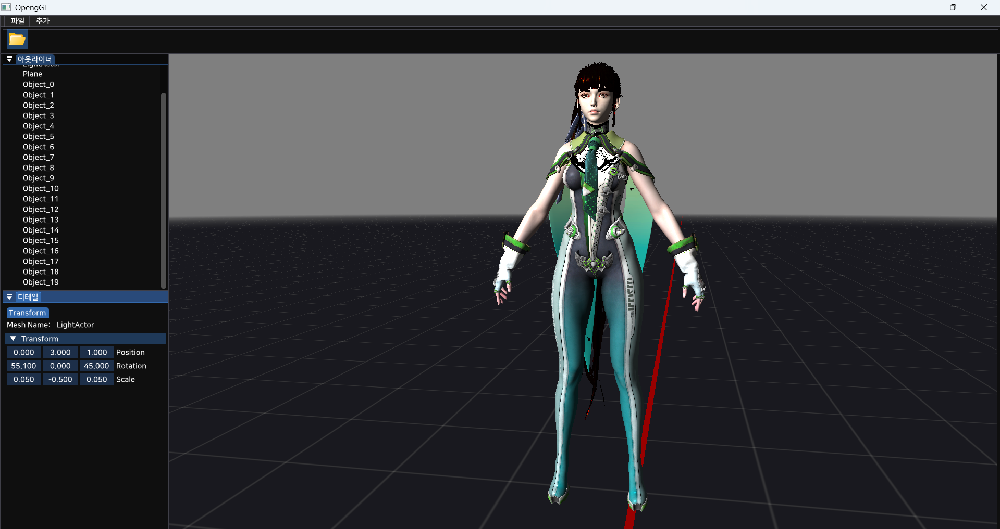
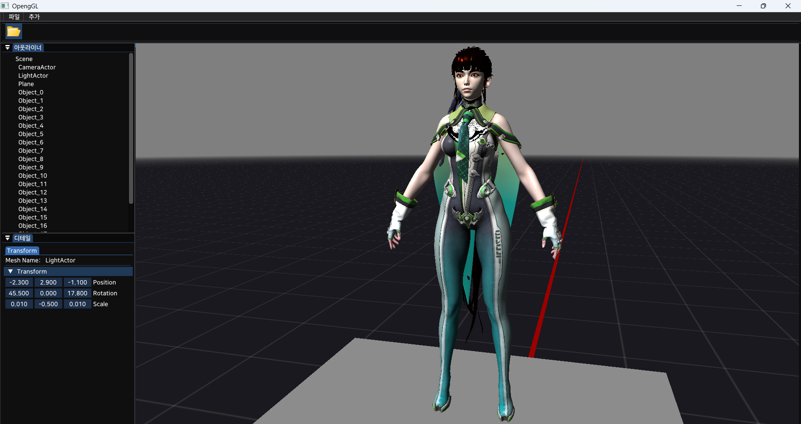

# OpenGL 3D Renderer (C++)

본 프로젝트는 **OpenGL 그래픽스 API**를 사용하여 **3D 렌더러(Renderer)**를 직접 설계 및 구현함으로써,  
**실시간 그래픽스 파이프라인**과 **렌더링 엔진 아키텍처**의 핵심 구조를 학습하는 것을 목표로 합니다.

## 주요 특징

- **OpenGL 기반 렌더링 파이프라인 구현**  
  정점 처리, 라스터화, 프래그먼트 연산 등 GPU 파이프라인 전 과정을 직접 구성

- **Forward Rendering 구조**  
  다중 광원 및 실시간 조명(Real-Time Lighting)을 지원하는 전방 렌더링 방식 적용

- **컴포넌트 기반 엔진 아키텍처**  
  Renderer, Actor, Component 단위로 모듈화된 엔진 구조 설계

- **핵심 컴포넌트 구현**
  - **SceneComponent** : Transform(Position, Rotation, Scale) 정보를 관리  
  - **MeshComponent**  : 정점·인덱스 버퍼 및 렌더링 데이터 관리  
  - **CameraComponent** : View, Projection 행렬 계산 및 뷰 변환 처리  
  - **LightComponent** : Driectional, Point, Spot 광원 관리

- **Shader & Material 시스템**  
  GLSL 셰이더 파이프라인 구축 및 머티리얼 파라미터 관리

- **Resource Manager**  
  메시, 텍스처, 셰이더, 머티리얼 등 렌더링에 필요한 리소스 관리

## 사용 라이브러리

- **GLFW** : OpenGL 컨텍스트 및 윈도우 관리, 입력 처리  
- **Assimp** : 3D 모델 포맷(.obj, .fbx, .glb 등) 로딩 및 메시 데이터 파싱  
- **stb_image** : 이미지(Texture) 파일 로딩  
- **Dear ImGui** : UI 시스템 구축

## 개발 목표

본 프로젝트는 **OpenGL을 활용한 3D 렌더링 파이프라인**의 작동 원리를 직접 구현하고, 렌더러(Renderer) 중심의 **엔진 구조 설계**를 통해 그래픽스 프로그래밍의 핵심 개념인 **장면(Scene) 관리**, **컴포넌트 기반 아키텍처**, **셰이더 파이프라인** 등을 체계적으로 학습하는 것을 목표로 합니다.

## 참고 사이트
- **https://learnopengl.com/**
- **https://media.korea.ac.kr/books/**

## 🖼️ 샘플 렌더 결과

파일 출처 : https://sketchfab.com/3d-models/stellar-blade-eve-planet-diving-suit-7th-e78c5f9da4ca491b971694566bb0482d