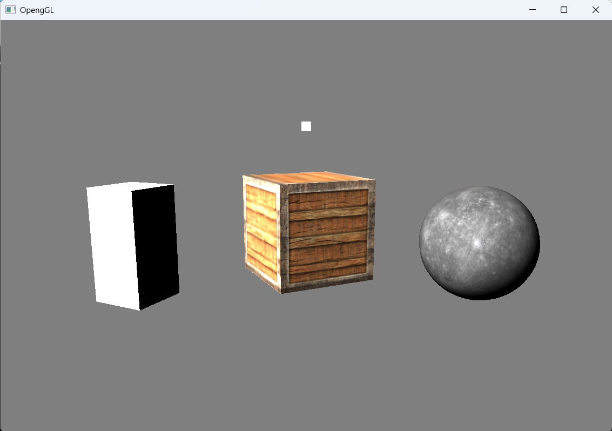

# OpenGL 3D Renderer (C++)

본 프로젝트는 **OpenGL 그래픽스 API**를 사용하여 **3D 렌더러(Renderer)**를 직접 설계 및 구현함으로써, 
**실시간 그래픽스 파이프라인**과 **렌더링 엔진 아키텍처**의 핵심 구조를 학습하는 것을 목표로 합니다.

## 주요 특징
- **OpenGL**을 이용한 렌더링 파이프라인 이해
- **Forward Rendering** 기반 실시간 렌더링 구조
- **엔진 구조(Renderer, Actor, Component)** 설계 및 구현
- **메시(Mesh), 카메라(Camera), 조명(Light)** Component 설계 및 구현
- **셰이더(Shader),매터리얼(Material)** 설계 및 구현

## 참고 사이트
- **https://learnopengl.com/**
- **https://media.korea.ac.kr/books/**

## 🖼️ 샘플 렌더 결과

파일 출처 : https://sketchfab.com/3d-models/stellar-blade-eve-planet-diving-suit-7th-e78c5f9da4ca491b971694566bb0482d